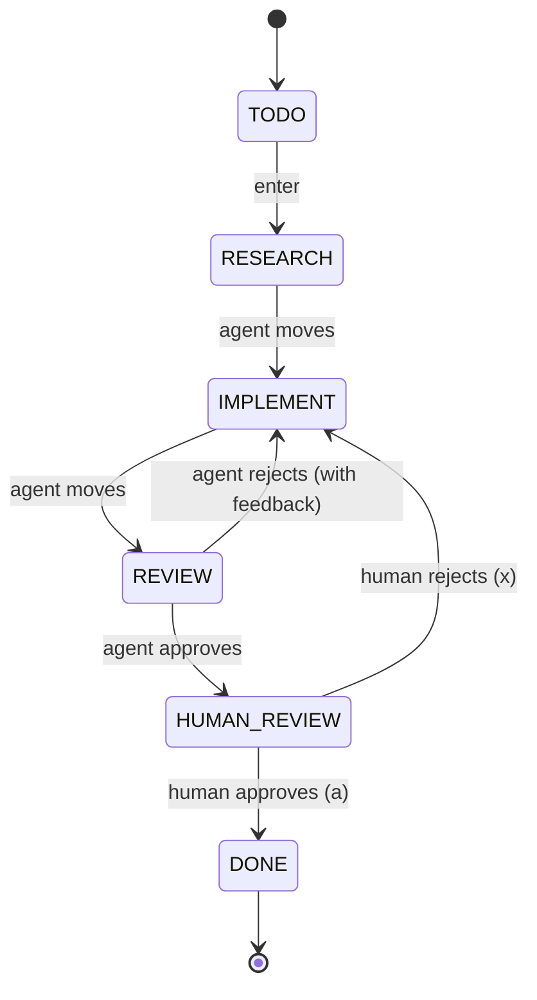

# AI Orchestration Pipeline

A TUI soak board that orchestrates Claude Code sessions through a configurable multi-stage ticket pipeline. Built with Go, embedded NATS JetStream, and tmux.

## Pipeline

Defined in `soak.yaml` — edit this file to change stages, agent prompts, tools, and transitions. No recompile needed.



## Architecture

```
soak.yaml              Defines stages, prompts, tools, transitions
     │
     ▼
┌──────────────┐     ┌──────────────────┐     ┌──────────────────┐
│  TUI Board   │────▶│  Embedded NATS   │◀────│  Claude Sessions │
│  (tab 1)     │     │  JetStream KV    │     │  (tmux tabs)     │
└──────────────┘     └──────────────────┘     └──────────────────┘
       │                                              │
       │  human: enter/a/x                            │  agent: soak move/reject
       └──────────────────────────────────────────────┘
```

- **soak.yaml** declares each stage: its title, agent prompt (Go templates), allowed tools, auto-spawn behavior, and reject targets
- **Board** runs an embedded NATS server with JetStream KV on port `14222`
- **Claude sessions** auto-spawn in background tmux tabs when tickets arrive in agent stages
- Agents call `./soak move <id>` or `./soak reject <id> "reason"` to drive transitions
- Board auto-refreshes every 2 seconds

## Configuration

Each stage in `soak.yaml`:

```yaml
stages:
  - name: research          # internal name (stored on tickets)
    title: RESEARCH          # display name in TUI
    agent:                   # null = human stage, no Claude session
      prompt: |              # Go template with {{.ID}}, {{.Title}}, {{.Feedback}}, {{.Kanban}}
        You are a research agent for {{.ID}}: "{{.Title}}".
        When done: {{.Kanban}} move {{.ID}}
      allowedTools:          # Claude --allowedTools (also templated)
        - "Bash({{.Kanban}}:*)"
        - "Read"
        - "Glob"
    auto: true               # auto-spawn when ticket arrives
    canReject: false          # can this stage reject tickets?
    rejectTo: ""              # which stage to reject back to
```

Template variables: `{{.ID}}`, `{{.Title}}`, `{{.Feedback}}`, `{{.Kanban}}` (path to binary).

## Usage

```bash
go build -o soak .
./soak
```

If not already in tmux, it auto-launches a tmux session.

### Keyboard shortcuts

| Key | Action |
|-----|--------|
| `h/l` or arrows | Navigate columns |
| `j/k` or arrows | Navigate tickets |
| `enter` | Advance ticket to next stage |
| `n` | Create new ticket |
| `c` | Open/switch to Claude tab for ticket |
| `a` | Approve (human stages only) |
| `x` | Reject (stages with canReject only) |
| `d` | Delete ticket |
| `q` | Quit |

### CLI (used by agents)

```bash
./soak move <ticket-id>              # advance to next stage
./soak reject <ticket-id> "reason"   # reject to configured rejectTo stage
./soak status <ticket-id>            # show ticket details
./soak list                          # list all tickets
./soak create <title>                # create a new ticket
./soak whoami                        # print ticket ID for current worktree
```

The `whoami` command detects which ticket you're working on based on your current directory (worktree). Combine it with other commands:

```bash
./soak move $(./soak whoami)                    # advance your ticket
./soak status $(./soak whoami)                  # check your ticket's state
./soak reject $(./soak whoami) "needs more info" # reject with feedback
```
